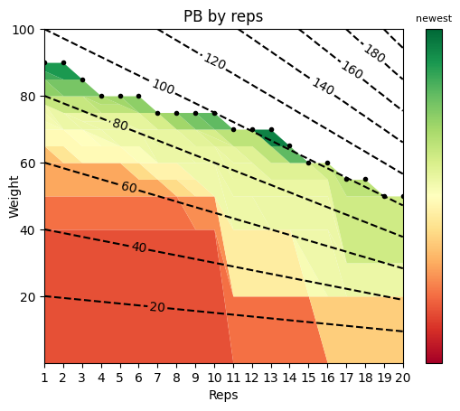

# Strength Log PB

In StrengthLog settings, export your data as csv and place in this directory

Change the input to `parse_strengthlog_workouts` to your file name

`print_excercise_names` will output all excercises you have trained, choose one as input to `extract_pbs_by_reps`

See the data visualized as every PB you have acheived per rep, the more green the graph the newer the PB.

Example (Bench Press):

## Dependencies

`numpy`
`matplotlib`
